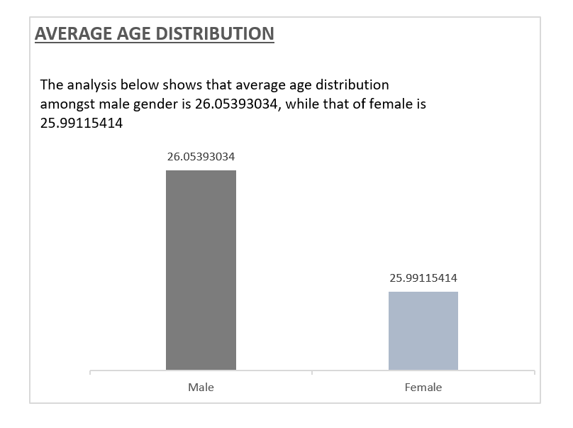
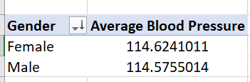

# Medical-and-Health-Wholesomeness-Analysis

This is a medical dataset analysis, carried out ascertain the health wholesomeness of the individual present in the data set, to derive insight into their gender, Body weight, height, Body index mass (BMI) etc. This is to assist the care assistant in their services to make inform decision concerning their diet, medication and health services to be provided for them.

**_DISCLAIMER**_:_ All data set and reports do not represent any individual, institution or any medical outfit, all data is imaginary and is used for the purpose of learning exercise.

Note: The analysis was carried out using Pivot table analyze for all fields. The specific item of analysis were placed in the required fields present eg, Filters, Legend, and values, and further adjusted to reflect the unit of analysis required and visualize to give a clearer insight into the data information within.

# DATA SET
---------

----

# Average age distribution
------

AVERAGE AGE          |      AVERAGE AGE
:-------------------:|:-----------------:
         |  

The analysis above shows that average age distribution amongst male gender is 26.05393034, while that of female is 25.99115414.

# Average BMI
-----
                       
Average BMI        |    Average BMI  
:-----------------:|:-----------------:
       |  

The above analysis shows the corresponding BMI on gender specifics
The average BMI amongst male and female gender is shown in the table above with the male (23.327914970 and  female (23.34783295), 

# AVERAGE TEMPERATURE
---------
AVERAGE TEMPERATURE |      AVERAGE TEMPERATURE
:------------------:|:-----------------:
       |  

The average temperature by gender is shown in the above analysis with temperature range of male to be 98.4015318 and that of female as 98.4004444

# AVERAGE HEART RATE
--------

HEART RATE          |      HEART RATE
:------------------:|:-----------------:
      |  

From the analysis carried on the average heart rate amongst genders. The average heart rate of the male is (78.49207266) and Female (78.6035638)

# AVERAGE BLOOD PRESSURE
-------

The analysis below shows the average blood pressure of male to be 114.5755014 and 114.6241011 for female

BLOOD PRESSURE      |      BLOOD PRESSURE
:------------------:|:-----------------:
    |  

# AVERAGE CHOLESTEROL
-------

CHOLESTEROL LEVEL      |      CHOLESTEROL LEVEL
:---------------------:|:-----------------:
   |  

The analysis shows there is a difference between the cholesterol level of male and female gender, with the male having an average cholesterol level of 184.5048053 and female 184.3828356.

# AVERAGE HEIGHT
--------
AVERAGE HEIGHT         |AVERAGE HEIGHT
:---------------------:|:-----------------:
   |  

The above analysis shows the average height difference between the male and female gender, which has been shown that of male to be 174.97 and that of male to be 174.93. 

# AVERAGE WEIGHT
-------
WEIGHT                |     WEIGHT             
:--------------------:|:-----------------:
       |  
The analysis shows the average weight between the male and female gender, and the female gender has the highest average weight of 69.98 and the male to be 69.96.

# BLOOD TYPE DISTRIBUTION
-------
BLOOD TYPE            | BLOOD TYPE
:--------------------:|:-----------------:
       |  

The analysis shows the number of students within a specific Blood group and has shown that the 

# SMOKING HABIT DISTRIBUTION
--------
SMOKING HABIT         |  SMOKING HABIT   
:--------------------:|:-----------------:
      |  

The analysis above shows the number of students who indulge in smoking.

# NUMBER OF STUDENTS WITH DIABETES HEALTH CONDITION
----------

DIABETIC CONDITION    | DIABETIC CONDITION
:--------------------:|:-----------------:
      |  

The analysis shows the number of students with health issues relating to Diabetes

# CONCLUSION
-----
The analysis provided insight into the health conditions of the individuals in the data set, and as such will give a clearer picture of the care, medical attention and life style to be adopted to enhance their health and wellbeing
